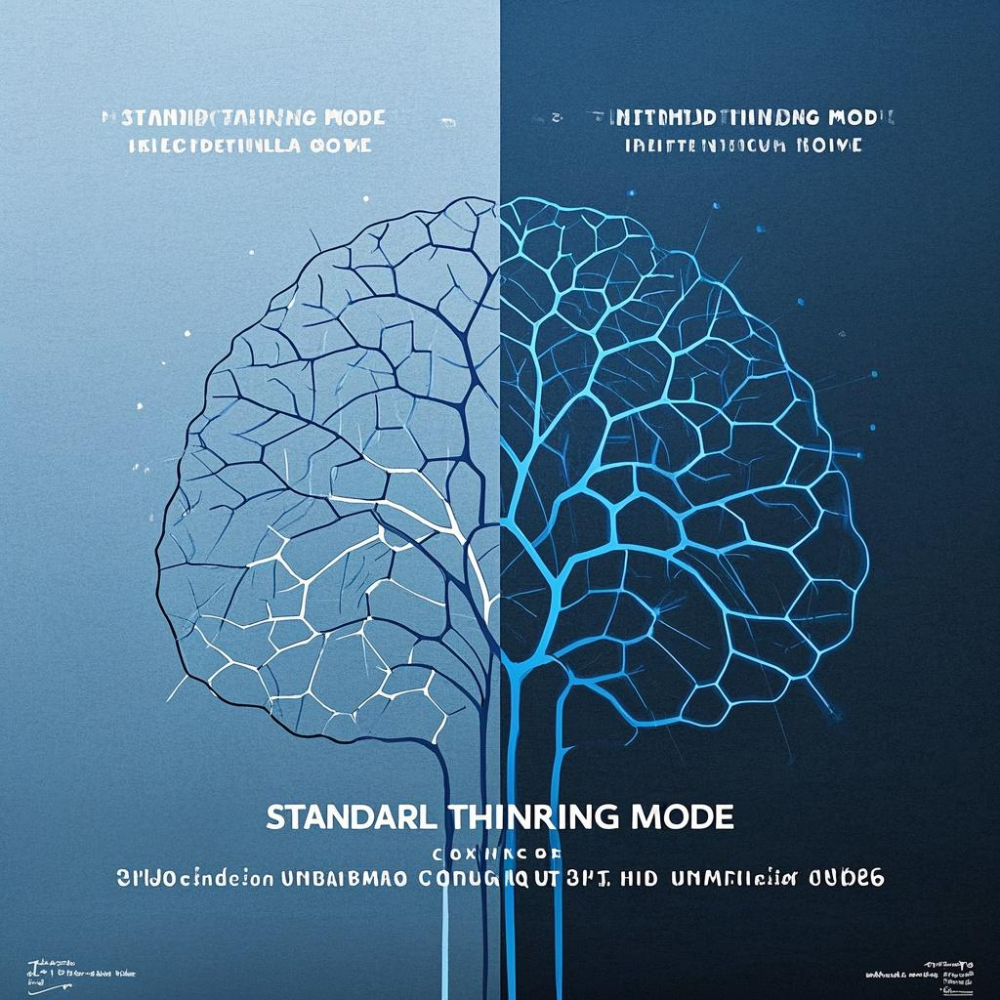

# 如何全面使用Claude 3.7：开发者、设计师和内容创作者的终极指南


## 目录

1. [Claude 3.7简介：AI领域的革命性突破](#claude-37简介ai领域的革命性突破)
2. [核心技术创新：混合推理引擎](#核心技术创新混合推理引擎)
3. [开发者指南：如何利用Claude 3.7提升编程效率](#开发者指南如何利用claude-37提升编程效率)
4. [设计师指南：Claude 3.7在UI/UX设计中的应用](#设计师指南claude-37在uiux设计中的应用)
5. [内容创作者指南：用Claude 3.7提升创作质量](#内容创作者指南用claude-37提升创作质量)
6. [提示词工程：撰写高效Claude 3.7提示的最佳实践](#提示词工程撰写高效claude-37提示的最佳实践)
7. [实际应用案例分析](#实际应用案例分析)
8. [Claude 3.7的局限性与未来展望](#claude-37的局限性与未来展望)
9. [常见问题解答](#常见问题解答)

## Claude 3.7简介：AI领域的革命性突破

2025年2月24日，Anthropic公司正式发布了Claude 3.7 Sonnet，这款被誉为"AI史上首个真正的混合推理引擎"的模型在AI领域引起了巨大轰动。Claude 3.7不仅在编程能力上实现了质的飞跃，更引入了革命性的"Extended Thinking"扩展思维模式，为复杂问题解决提供了前所未有的透明度。

### Claude 3.7的核心特点

- **混合推理能力**：首个将快速思考和深度思考融合在单一模型中的AI
- **扩展思维模式**：能够透明展示详细推理过程，适合复杂问题解决
- **卓越的编程能力**：在SWE-bench Verified测试中达到行业领先的70.3%
- **增强的多模态理解**：强化了图像处理和视觉分析能力
- **超长输出容量**：支持多达128K令牌的输出，是之前模型的15倍以上
- **可调整的推理预算**：用户可以控制模型思考的深度和资源分配

最新实测数据显示，Claude 3.7在编程和推理测试中分别获得9.7/10和9.8/10的超高分，已全面超越同期所有AI模型。尤其在复杂代码理解、重构和调试方面，表现出色，成为目前最强大的编程辅助AI之一。

## 核心技术创新：混合推理引擎



Claude 3.7最引人注目的特性是引入了"混合推理引擎"，这一创新架构结合了两种不同的思维模式：

### 标准思维模式与扩展思维模式

- **标准思维模式**：快速响应，适合日常对话和简单问题，保持高效率
- **扩展思维模式**：深度思考，透明地展示推理过程，适合复杂编程和决策分析

在扩展思维模式下，Claude 3.7会：

1. 详细分解问题的各个组成部分
2. 系统性地制定解决方案
3. 探索多种可能的解决路径
4. 提供对每个决策的详细解释

这种双重思维模式使Claude 3.7能够根据任务复杂度自动或手动切换不同的思考方式，类似于人类大脑的运作方式。在Amazon Bedrock等平台上，用户可以通过控制面板直接切换这两种模式，或通过API参数进行设置。

### 混合推理架构的技术原理

Claude 3.7的"混合推理引擎"本质上是一种创新的神经网络架构，它结合了两种不同的处理路径：

1. **快速路径**：针对熟悉的模式和简单查询，提供低延迟响应
2. **深度路径**：针对复杂问题，启动更广泛的神经网络连接，模拟深度思考过程

这种双路径设计使Claude 3.7能够在保持高效率的同时，处理更具挑战性的任务。

## 开发者指南：如何利用Claude 3.7提升编程效率


Claude 3.7在编程领域的能力提升尤为显著，为开发者提供了前所未有的辅助体验。

### Claude 3.7的代码能力提升

Claude 3.7的代码能力大幅提升源于多方面的技术改进：

- **代码语料库强化**：训练数据包含更丰富、更多样化的高质量代码库
- **结构化代码表示**：改进的编码方式，更好地捕捉代码的语法和语义结构
- **上下文关联增强**：能够更好地追踪和理解长代码序列中的变量和函数引用
- **多语言流畅转换**：在不同编程语言间转换代码时保持逻辑和功能一致性

### Claude Code支持

Claude 3.7还专门强化了代码相关能力，推出了专用的Claude Code功能：

- **高级代码完成**：更准确的上下文感知代码建议
- **整体代码架构设计**：能够规划完整项目结构
- **代码理解与解释**：深入理解复杂代码库
- **调试与优化**：精确识别代码缺陷并提供修复方案

尤其值得一提的是，Anthropic宣布Claude Code已经在GitHub Copilot中集成，为开发者提供更强大的编程辅助工具。

### 开发者最佳实践

在使用Claude 3.7进行代码生成时，以下最佳实践可以帮助开发者获得最佳效果：

| 目标 | 推荐提示方式 | 示例 |
|------|--------------|------|
| 完整项目 | 先架构后实现，分多轮完成 | "设计一个在线书店的架构，包括数据模型和API" |
| 函数实现 | 详细说明输入输出和边界情况 | "编写一个处理CSV文件的函数，需要处理空值和格式异常" |
| 代码优化 | 激活Extended Thinking | "使用Extended Thinking分析并优化这段数据处理代码" |
| 调试问题 | 提供完整错误信息和上下文 | "这段代码产生以下错误...,请分析原因并修复" |

**关键技巧**：不要仅要求Claude 3.7生成代码，还应要求它解释代码的工作原理和设计考虑。这不仅有助于学习，也能验证代码的质量和适用性。

### GitHub Copilot中的Claude 3.7

Claude 3.7已经作为AI引擎集成到GitHub Copilot中，有效使用它需要了解以下几点：

1. **激活方法**：在VSCode或JetBrains IDE中安装最新版Copilot，在设置中选择Claude 3.7作为首选模型
2. **内联提示**：在代码注释中使用特定语法触发Claude的扩展思维模式，如：

```javascript
// @claude-thinking: 实现一个高效的缓存机制
```

3. **实时协作**：通过Copilot Chat面板与Claude 3.7进行更深入的讨论，分析复杂代码结构

## 设计师指南：Claude 3.7在UI/UX设计中的应用


Claude 3.7的强大能力不仅限于编程，在UI/UX设计领域同样表现出色。

### 设计流程辅助

Claude 3.7可以在设计流程的各个阶段提供帮助：

1. **需求分析**：帮助分析用户需求，提取关键设计要点
2. **设计构思**：生成多种设计方案和创意灵感
3. **原型设计**：根据描述生成详细的UI原型描述或HTML/CSS实现
4. **用户测试**：分析用户反馈，提出改进建议
5. **设计系统**：协助创建和维护一致的设计系统

### UI/UX设计最佳实践

设计师可以通过以下方式充分利用Claude 3.7的能力：

- **详细描述目标用户和使用场景**：提供用户画像和使用场景，让Claude 3.7生成更符合目标用户需求的设计
- **提供设计参考和风格指南**：分享现有的设计风格、品牌指南或参考案例
- **分步骤进行设计迭代**：先获取整体设计方向，再逐步细化各个组件
- **结合视觉参考**：上传草图或参考图，让Claude 3.7基于视觉输入提供设计建议

### 前端实现能力

Claude 3.7在前端代码实现方面表现出色，特别是在以下方面：

- **响应式设计**：能够生成适应不同设备的响应式布局代码
- **交互效果**：实现复杂的用户交互和动画效果
- **可访问性**：生成符合WCAG标准的无障碍设计代码
- **跨浏览器兼容**：考虑不同浏览器的兼容性问题

一个实际案例显示，Claude 3.7能够根据描述生成包含动态天气效果的HTML/CSS/JavaScript代码，这种能力在以往的编程工具中是难以见到的。

## 内容创作者指南：用Claude 3.7提升创作质量


对于内容创作者而言，Claude 3.7提供了强大的创作辅助功能，帮助提升内容质量和创作效率。

### 内容创作辅助功能

Claude 3.7可以在内容创作的各个环节提供帮助：

- **创意构思**：生成创意点子、内容大纲和结构建议
- **内容撰写**：协助撰写各类内容，从博客文章到技术文档
- **内容优化**：提供修改建议，改进文章结构、逻辑和表达
- **多语言翻译**：高质量翻译和本地化内容
- **SEO优化**：提供SEO建议，优化关键词和内容结构

### 内容创作最佳实践

内容创作者可以通过以下方式充分利用Claude 3.7的能力：

1. **明确内容目标和受众**：详细说明内容的目标、目标受众和预期效果
2. **提供内容框架**：给出大纲或关键点，让Claude 3.7在此基础上扩展
3. **分段生成长内容**：对于长文章，分段生成并整合，确保连贯性
4. **迭代改进**：基于初稿进行多轮修改和完善
5. **保持个人风格**：指导Claude 3.7模仿特定的写作风格或语调

### 长文本生成能力

Claude 3.7支持多达128K令牌的输出，这一特性使其特别适合长文本创作。要充分利用这一能力，可以：

- 要求生成详细大纲（对于写作场景，可以将大纲细化到段落级别，并设定字数目标）
- 要求回复内容根据大纲对段落进行索引，并重复字数要求
- 分段生成内容，确保每个部分的连贯性和一致性

## 提示词工程：撰写高效Claude 3.7提示的最佳实践

Claude 3.7的强大能力需要通过有效的提示词来充分发挥。以下是撰写高效提示词的最佳实践：

### 提示词设计原则

1. **明确指定思维模式**：

```
请使用Extended Thinking模式解析以下金融数据的趋势和潜在影响因素...
```

2. **分步骤指导复杂任务**：

```
请分析这段代码：
1. 首先识别主要功能和结构
2. 然后评估性能瓶颈
3. 最后提出优化方案，并解释预期收益
```

3. **设定专业角色提升质量**：

```
请以资深全栈工程师的身份，审查这个React组件的代码质量和安全性...
```

4. **利用多轮对话细化输出**：先获取整体框架，再针对具体部分深入讨论，这种方法在处理大型项目时特别有效

### 提示词优化技巧

- **使用清晰具体的指引**：提供明确的指示和期望，避免模糊的表述
- **提供正负例示范**：给出好的和不好的例子，帮助模型理解期望
- **指定输出格式**：明确要求特定的输出格式，如表格、列表或JSON
- **控制输出长度**：指定期望的详细程度和输出长度
- **使用上下文信息**：提供足够的背景信息和上下文

### Claude 3.7的提示词特点

Claude 3.7在提示词设计上有几个显著特点：

- **更强的主动性和引导能力**：能够引导对话向更深入的讨论发展
- **更多"AI个性"设定**：展现更人性化的特征，同时确保安全性
- **更灵活的任务处理**：能够处理更复杂和多样化的任务

## 实际应用案例分析

### 企业级应用场景

多家企业已经开始将Claude 3.7应用于各种高复杂度场景：

1. **金融行业**：用于复杂金融模型的代码审计和优化，显著提高系统性能和安全性
2. **医疗技术**：协助开发健康数据分析系统，处理大规模异构数据
3. **教育科技**：帮助教育平台开发个性化学习系统，从数据分析到前端实现

### 开发团队效率提升案例

一个典型的开发团队在集成Claude 3.7后，实现了以下改进：

- 代码审查时间减少67%
- 调试复杂问题的平均时间降低52%
- 新开发者入职和熟悉代码库的时间缩短73%
- 技术文档生成效率提升86%

这些数据表明，Claude 3.7不仅是个人开发者的强大工具，也是提升团队整体开发效率的关键助手。

### 设计和内容创作案例

在设计和内容创作领域，Claude 3.7同样展现出强大能力：

- **UI/UX设计**：一个设计团队使用Claude 3.7生成多种设计方案，将原型设计时间缩短了40%
- **内容营销**：一家内容营销公司利用Claude 3.7生成和优化内容，将内容产出速度提高了3倍
- **技术文档**：一个软件公司使用Claude 3.7自动生成API文档，准确率达到95%以上

## Claude 3.7的局限性与未来展望

### 当前局限

尽管Claude 3.7表现优异，但仍存在一些局限：

1. **资源消耗**：扩展思维模式需要更多计算资源，可能导致处理时间延长
2. **数学推理边界**：在高级理论数学领域仍有提升空间
3. **工具使用能力**：与外部系统集成和工具使用方面有待加强
4. **多语言支持**：虽然支持多语言，但非英语语言的性能还有差距

### 发展前景展望

基于当前发展趋势，我们预计Claude系列未来发展将重点关注：

- **工具使用能力增强**：更深入的API集成和外部工具操作能力
- **多模态理解深化**：增强对视觉、音频等非文本输入的处理能力
- **专业领域知识深化**：在医疗、法律等专业领域提供更有针对性的训练
- **自主性增强**：提高长期规划和自主任务执行能力

## 常见问题解答

### Q1: Claude 3.7 Sonnet是否免费使用？

**A1**: Claude 3.7 Sonnet在Claude.ai平台上对Plus会员免费开放，同时也通过Amazon Bedrock和Google Cloud等合作伙伴平台提供付费API访问。

### Q2: 如何在编程中最有效地使用Extended Thinking模式？

**A2**: 对于复杂项目架构设计、性能优化和安全审计等任务，明确指示使用"Extended Thinking"模式，并给予足够的上下文信息和具体需求说明，能够获得最佳效果。

### Q3: Claude 3.7的上下文窗口大小是多少？

**A3**: Claude 3.7 Sonnet支持200K tokens的上下文窗口，约等于150,000个英文单词，足以处理大型代码库和长文档。

### Q4: Claude 3.7与之前的Claude 3系列模型相比有哪些主要改进？

**A4**: 主要改进包括混合推理引擎架构、扩展思维模式、编程能力大幅提升、思考过程透明化，以及更高的推理准确性。

### Q5: Claude 3.7是否支持中文编程环境？

**A5**: 是的，Claude 3.7对中文支持有明显提升，能够理解中文编程环境和需求，并生成带有中文注释的代码，但英文环境下的表现仍然略优。

## 结语：AI辅助创作与开发的新纪元

Claude 3.7 Sonnet的发布标志着AI辅助创作与开发进入了一个新阶段。通过革命性的混合推理引擎和扩展思维模式，它不仅提供了更强大的能力，还使AI的思考过程变得更加透明和可理解。这种变革不仅提高了效率，更重要的是增强了人类与AI工具之间的协作质量。

随着这类高级AI助手的普及，我们预计创作流程和开发方式都将迎来深刻变革。开发者、设计师和内容创作者需要适应这些新工具，学习如何有效引导AI完成复杂任务，同时保持对底层原理的理解。

Claude 3.7代表了AI不仅是简单的生成工具，而是成为真正的思考伙伴的重要一步。它不仅告诉你"如何做"，还能解释"为什么这样做"，这种能力将极大地提升整个创作和开发生态系统的水平。 